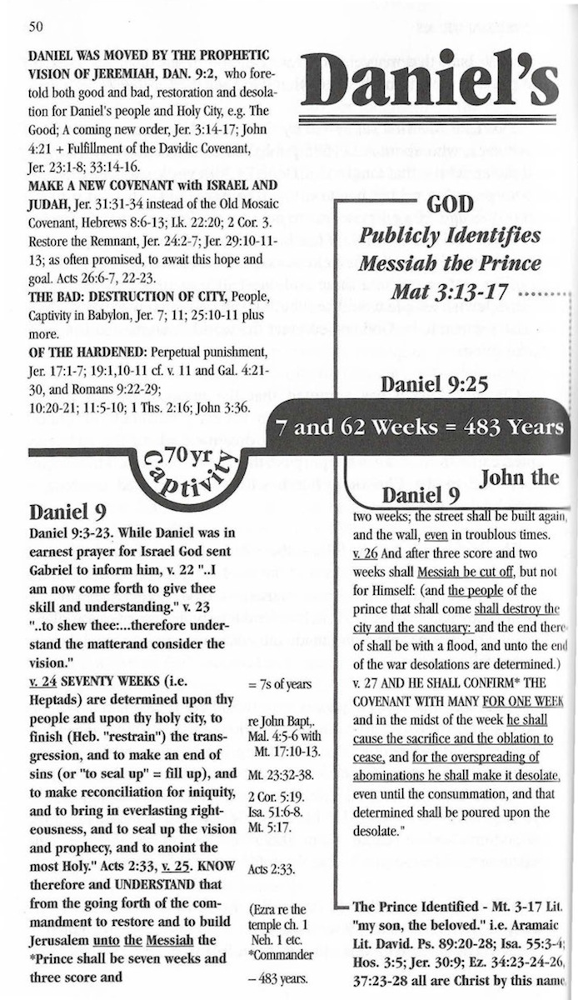
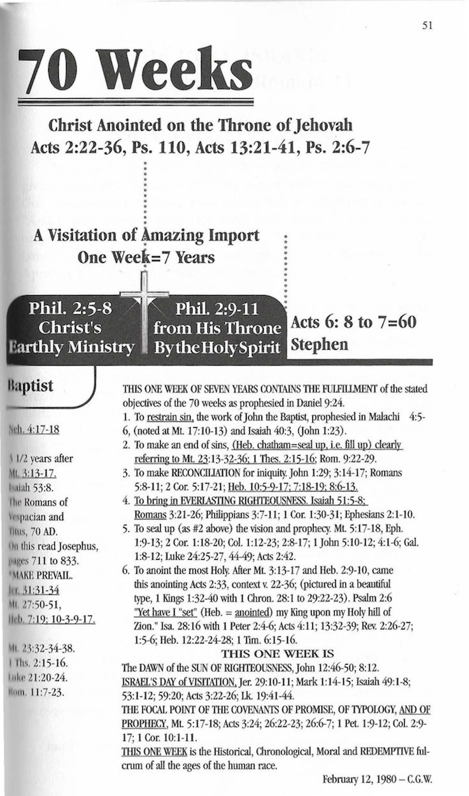

# Daniel's 70 Weeks

by
 CHARLES GILBERT WESTON

Taken from cassette tapes and notes from
 <i>The Weston Study Bible</i> by EMMA MOORE WESTON

Daniel's mind was troubled and his soul shaken by what he read in the scrolls of Jeremiah the prophet. Jeremiah prophesied a return from their 70-year captivity in Babylon. That was good, but there were other terrible prophecies that he did not understand. God said that he would visit them to perform his good word toward them in causing them to return from all nations where he had driven them and give them "an expected end."

But Jeremiah saw two baskets of figs, some very good and some so bad that they could not be eaten. These represented people. God would give the good figs a heart to know him (Jer 24:7), and they would be his people and he would be their God for they would return to him with all their heart.

But the bad figs would be removed to all the kingdoms of the earth to be a reproach and a proverb, a taunt and a curse in all the places where he would send them. Jeremiah took a bad vessel out and broke it before the elders of the people so it was beyond repair and told them that God would do just that to this people and city. (Jer 24:8.)

Daniel put on sackcloth and ashes and gave himself by prayer and fasting to seek God. In deep distress and repentance, he prayed.

"Then Gabriel was caused to fly swiftly and touched me about the time of the evening oblation and informed me. Now, Daniel I have come to give thee skill and understanding ... Now therefore understand the matter and consider the vision. I have come to show thee and give thee understanding." (Da 9:21-23) What matter? What vision? The vision that Jeremiah gave him of what was to take place when the Messiah would come.

"Seventy weeks are determined upon thy people and the holy city to finish the transgression and to make an end of sin and to make reconciliation for iniquity and to bring in everlasting righteousness and to seal up the hidden prophecy and to anoint the most Holy. From the going forth of the commandment to restore and to build Jerusalem unto Messiah the Prince shall be seven weeks, and threescore and two weeks: the street shall be built again, and the wall, even in troublous times." (Da 9:24-25) A day for a year is the proper method of interpretation for the time measure present here. In these verses the calculated days equal 483 years. In the first seven weeks of years (49 years) they had a job to do in rebuilding the city.

Who could ask for anything more specific? Now they can know when he is coming and have time to prepare. The scholars knew it was time for Messiah to come when the rumors went through the land that angels had announced his coming at the birth of Jesus.

They had thirty more years to wait before Jesus walked down to the Jordan to be baptized. As he went up out of the water, they saw a dove descend on him and a voice from heaven said, "This is my Son in whom I am well pleased." (Mt 3:17) This was the end of the 69th week, which fills the 483 years before Messiah should come. It is marked by the end of the time and by the special name, The Prince. The Father identified him as "David" (Strong's #1732): the Hebrew form of the English "the beloved." The literal Greek is, "This is my Son, the Beloved, that is the prophesied David:" (Ps 89:3 and 26-37: Isa 55:3-4; Jer 30:5-9; Eze 34:23; 37:24; Hos 3:5; Eph 1:6 and Col 1:13) God publicly identified and gave witness to Messiah-King explicitly as his elect Prince of David's line:

"After threescore and two weeks shall Messiah be cut off, but not for himself: and the people of the prince that should come shall destroy the city and the sanctuary; and the end shall be with a flood and to the end of the war desolations shall be determined." (Da 9:2427) ("The prince to come to destroy" is a parenthetical statement, for it does not fit into the things that were to be done in the 70th week.) "He shall confirm the covenant with many for one week: and in the midst of the week he shall cause the sacrifice and oblation to cease and for the overspreading of abomination he shall make it desolate even until the consummation."

This 27th verse of Daniel 9 has been wrongly interpreted. "He shall confirm the covenant with many." Some say, "The Antichrist will make a treaty with the Israelis to bring peace in the Middle East. He breaks the covenant in the middle of the week and then we have the great tribulation." That isn't what it says. "He shall confirm the Covenant with many for ONE WEEK." Confirm means to prevail; it is a military word -- one side wins over the other side. He causes the Covenant to prevail for SEVEN years. What Covenant? "Well, the Antichrist comes and he makes the covenant." Where did they get the Antichrist? Jeremiah says nothing about an Antichrist. A New Covenant is to be made with Israel by Messiah, the Prince, and he forgives their sins and writes his word in their hearts. It is the New Covenant and it is Messiah who makes it.

All time and eternity hang upon this seven year Visitation. Seventy weeks of years (490 years) are determined to accomplish the six prophecies, not one of which was done in the sixty-nine weeks (483 years). All six prophecies are fulfilled in the 70th week. If the 70th week was postponed, then all awaits to be fulfilled. Then the 70 means nothing. And Calvary? And Pentecost?

See Da 9:24: One week of seven years contains fulfillment of the objectives stated:

1. "To finish the transgressions." Finish, _kala_ (Strong's #3607 Heb) restrict, hold back, to restrain sin, starts with the work of John the Baptist. (Mal 4:5-6; Jn 1:23) 

2. "To make an end of sins." _Chatham_ (Strong's #2856 Heb): seal up, fill up, referring to Mt 23:13-36; 1Th 2:15-16 and Ro 9:22-29. "The Lord hath laid on him the iniquity of us all." (Isa 53:6b)

3. "To make reconciliation for iniquity." _Kaphar_ (Strong's #3722 Heb). See Jn 3:15-17; Ro 5:8-11; 2Co 5:17-21 and Heb 10:5-17; 7:18-19 and 8:6-13. Reconciliation as Eze 45:15, 17. "Christ died for us." (Ro 5:8b)

4. "To bring in everlasting righteousness." As Isa 51:5-8; Ro 3:2126; Php 3:7-11; 1Co 1:30 and Eph 2:1-10, "to declare his righteousness." (Ro 3:26)

5. "To seal up the vision and prophecy." _Chatham_ (Mt 5:17-18; Eph 1:9-13; 2Co 1:18-20; Col 1:12-23; 2:8-17; 1Jn 5:10-12; 4:16 and Gal 1:8-12)

6. "To anoint the most holy." After Mt 3:13-17 and Heb 2:9-10 came the anointing in Ac 2:22-36, v. 33. This is pictured in beautiful type in the anointing of Solomon (1Ki 1:32-40) with 1Ch 28:1 to 29:22-23. "Yet have I set [anointed] my king upon my holy hill of Zion." (Ps 2:6, Cf. Isa 28:16 with 1Pe 2:4-6; Ac 4:11; 13:32-39; Rev 2:26-27; Heb 12:22-28 and 1Ti 6:15-16)

This week is the dawn of the Son of righteousness, (Jn 12:47-50; 8:12; lsa 59:20; Ac 3:22-26; Lk 19:41-44) and the focal point of the Covenants of promise, of typology and of prophecy, (Mt 5: 17-18; Ac 3:24; 26:22-23; 26:6-7; 1Pe 1:9-12; Col 2:9-17 and 1Co 10:1-11.) _This one week is the historical, chronological, moral and redemptive fulcrum of all the ages of the human race._

All events in Da 9:24 occurred in the seven years AFTER the 69th week with no break. Study Jeremiah chapters 29 to 31 where these events are foretold and about which Daniel inquired.

"He shall make the Covenant to prevail for one week." Gabriel was speaking of the prophecy of Jer 31:31-37, not just any, but "THE COVENANT," a new one with God's laws written in their hearts. He will forgive their iniquity and remember their sins no more. (Da 9:2127) Once the Messiah came, he was given one prophetic week of seven years to see it through.

At the end of the 69 weeks, God publicly identified Messiah, the Prince. (Mt 3:13-17) The 69 weeks (seven plus threescore and two) began in 457 B.C. with the decree of Artaxerses, (Ezra 7:11-13) and were fulfilled in A.D. 27, 483 years later. (cf. Lk 3:22-23.)

The New Covenant is to be confirmed for seven years. The seven years began in A.D. 27 and ended in A.D. 34, three and one half years of Christ's earthly ministry, then Calvary. Israel betrayed and crucified her King in the midst of the week. He was cut off, but not for himself. "For the transgression of my people was he stricken." (Isa 53:8c) Then there were three and one half years of Christ's ministry, exclusively to the Jews, from his throne by the Holy Spirit -- thus ending the 490 years.

Some teachers read the prophecies that were given during the captivity about their return, as if they should now be brought back to Israel. They take those promises and say, "You see, God said he is going to bring them back and they are coming back now." That is not the way to handle Scripture. You have to take the context and their point of view. God says that at the end of the captivity in Babylon is when the promises are to be fulfilled. _Not in A.D. 20th century._

"I know the thoughts I think toward you, saith Jehovah. Then shall ye call upon me and ye shall go and pray unto me, and I will hearken unto you, and ye shall seek me, and find me when ye shall search for me with all your heart. And I will be found of you, saith the Lord, and I will gather you from all the nations, and places where I have driven you, saith the Lord, and I will bring you again into the place where l caused you to be carried away captive." (Jer 29:11-14) The context shows he is talking about the Remnant who would serve him.

But from verses 17 to 19, the word to the ungodly majority is, "Behold, I will send upon them the sword, the famine, and the pestilence, and I will make them like vile figs that cannot be eaten they are so evil ... And I will deliver them to be removed to all the nations of the earth and will make them a curse and an astonishment and a hissing and a reproach among all the nations where they are driven: Because they have not harkened to my words, saith the Lord."

Two things are involved here. One -- the destruction of the apostate group, two -- Jacob's trouble. God offers them no hope whatever. The salvation of Jacob out of it. That's the Remnant which became the Church of Jesus Christ. The ones that sought and found the Lord. See Ro 9:21-29.

The great work of God in Christ Jesus in the seven-year Visitation, was when God in person came down from the ivory palaces into a world of woe, took upon him the form of a servant, humbled himself and became obedient unto death to bring the New Covenant for all mankind. _It is the greatest thing that ever happened in time or eternity; nothing could be greater._ That is the Covenant it is talking about. It is explaining Jeremiah and the vision and hope that he laid before the children of Israel upon their return to the land in order to be there to receive the Messiah at the end of the 69 weeks. In spite of the fact that he was meek and lowly and coming to his people offering salvation, peace, love and a now life, they would not receive him, but rejected, condemned and crucified him. The reception God got from mankind was beyond understanding. The prophet said he came to set judgment in the earth and bring light to the Gentiles. He would not fail or be discouraged until he had accomplished his mission and that agrees with the comment that he would cause the Covenant to prevail. It is a warfare with all hell set against God in the flesh to destroy him and try to break this plan of God for the salvation of mankind. In spite of everything the devil could do against him, he was not discouraged. He went all the way to Calvary and down to hell and took captivity captive and is seated at the right hand of God, having wrought eternal salvation for us. He purged our sins and became the mediator of the New Covenant. He had brought the Covenant -- a wonderful thing. The Messiah is mentioned in the 24th verse explicitly as fulfilling the law and as sealing up prophecy and as being anointed and bringing reconciliation for sins, salvation and everlasting righteousness.

"He shall confirm the Covenant with many." (v. 27.) Why not the whole nation? The nation as a whole rejected him and his Covenant. Yet he was able to make it prevail for seven years -- with many. What Jesus began to do and to teach took him as far as Calvary and the Resurrection. After that he poured out the Holy Spirit on the believers at Pentecost.

Then he ministered from his throne through his followers for three and a half years until Stephen was stoned, the church scattered, and the gospel was taken to the Gentiles. It was the fulfillment of Da 9:27. Christ confirmed the Covenant and caused the sacrifice and oblation to cease. (Heb. 10:1-14, esp. v. 9) "He taketh away the first that he may establish the second." The New Covenant could not be confirmed except by the taking away of the Old Mosaic Covenant. It had to be done by the crucifixion of the Messiah. He took it out of the way, nailing it to his cross in the midst of that week and that did away with the sacrifice and oblation. When the veil was rent in twain in the temple, the fulfillment was absolutely precise. It had to be done in that week after the introduction of the Messiah at the Jordan when God identified him for exactly who he was. He was to make the Covenant prevail for seven years and that he did precisely.

Some teachers put the fulfillment at the end of this age and then they go to Thessalonians and find the Antichrist and bring him back to Daniel 9. Isn't that marvelous? How can you break the 70th week off and put it at the end of this age when God fulfilled it then?

This idea was first suggested by Francisco Ribera, a Jesuit priest of Salamanca, who about A.D. 1585 published a commentary on Babylon and the antichrist that taught that Daniel's 70th week was in the future. Ribera put a big rubber band on the 70th week and extended it to the end of this age. His purpose was to counter the Protestant Reformation and to set aside the Protestant teaching of the time that the papacy was the antichrist. He put the first chapters of the Revelation in the first century. The rest he put in a three and one half year period at the end of time. A Jewish temple would be rebuilt by an antichrist who would deny Christ, pretend to be God and conquer the world. Imagination is a wonderful thing!

Clarence Larkin has admitted that the material he got for his prophetic charts came from Francisco Ribera. Thousands of sincere ministers have used these charts -- not dreaming where the facts presented came from or for what purpose they were intended. The damage Ribera did to the Christian church with this concocted teaching is beyond calculation!

The 70th week has to follow the 69th -- three and one half years until he was cut off, then the rest of the week he ministered through his servants from heaven. Judgment waited as God gave Israel time to repent. They had until A.D. 70 before God totally destroyed -- completely wiped out the people -- and made the country an uninhabited desolation for fifty years.

Titus, the prince of the people who would come (Romans), and his soldiers who were gathered out of all nations of the empire, destroyed Jerusalem and the people. He was doing the bidding of Christ. The Remnant that accepted Christ left the city in obedience to Mt 24:15-22 and Lk 20:21, and escaped safely, but wrath was poured upon Christ rejecting Israel. (1Th 2:14-16; Mt 23:32-36.) Wrath fell only upon the disobedient and it came upon them to the uttermost. (See the Destruction of Jerusalem in The Weston Study Bible appendix.)

All scholars agree that in Daniel the divine time measure is a day for a year. (Eze 4:6.) The 70 weeks began in 457 B.C. and concluded in A.D. 34. **The prophecy has already been fulfilled.**

